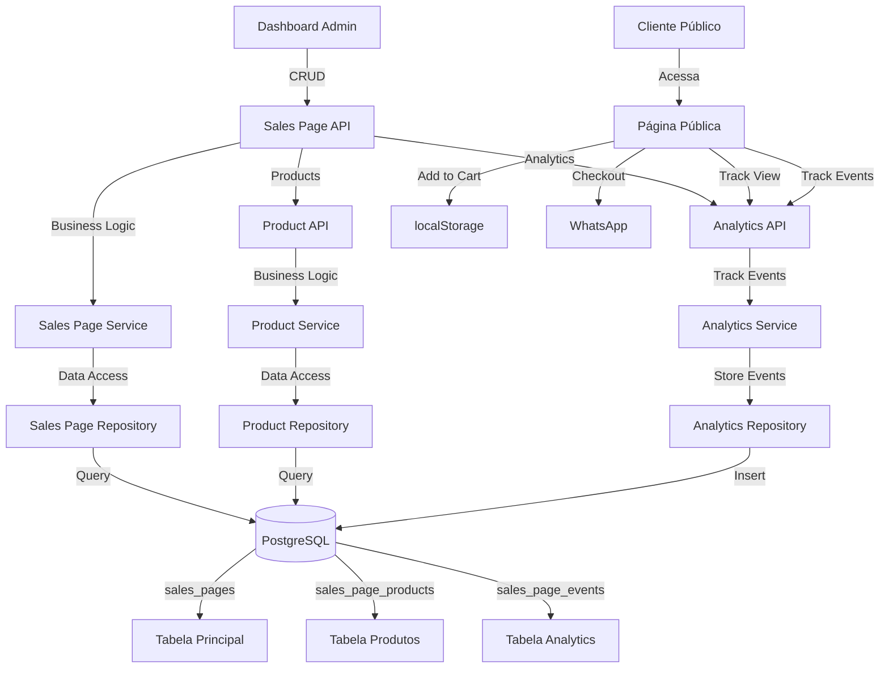

# Plano: Módulo Página de Vendas Premium

## Visão Geral

Módulo completo de página de vendas SaaS premium com arquitetura escalável, analytics completo, controle de status (DRAFT, PUBLISHED, PAUSED, ARCHIVED), tracking de eventos e página pública de alto padrão inspirada nas melhores práticas de e-commerce mundial (Amazon, Mercado Livre, Magazine Luiza, Casas Bahia).

## Arquitetura Completa



## 1. Banco de Dados

### 1.1 Migration: `migrations/2025_XX_XX_create_sales_pages_module.sql`

**Enums:**

```sql
CREATE TYPE sales_page_status AS ENUM ('DRAFT', 'PUBLISHED', 'PAUSED', 'ARCHIVED');
CREATE TYPE product_status AS ENUM ('ACTIVE', 'PAUSED', 'OUT_OF_STOCK', 'ARCHIVED');
CREATE TYPE event_type AS ENUM ('page_view', 'product_view', 'product_click', 'add_to_cart', 'checkout_click');
```

**Tabela `sales_pages`:**

- `id` (SERIAL PRIMARY KEY)
- `profile_item_id` (INTEGER, FK para profile_items, UNIQUE)
- `slug` (VARCHAR(255) UNIQUE) - Slug único para URL
- `store_title` (VARCHAR(255) NOT NULL)
- `store_description` (TEXT)
- `button_text` (VARCHAR(100)) - Texto do botão personalizado
- `button_logo_url` (TEXT) - URL da logo do botão
- `theme` (VARCHAR(10) DEFAULT 'dark') - Tema: 'light' ou 'dark'
- `background_color` (VARCHAR(7)) - Cor de fundo (#hex)
- `text_color` (VARCHAR(7)) - Cor do texto
- `button_color` (VARCHAR(7)) - Cor do botão
- `button_text_color` (VARCHAR(7)) - Cor do texto do botão
- `background_image_url` (TEXT) - Imagem de fundo opcional
- `whatsapp_number` (VARCHAR(20) NOT NULL) - Número WhatsApp para checkout
- `meta_title` (VARCHAR(255)) - SEO: título da página
- `meta_description` (TEXT) - SEO: descrição da página
- `meta_image_url` (TEXT) - SEO: imagem Open Graph
- `preview_token` (VARCHAR(255) UNIQUE) - Token para preview seguro de DRAFT
- `status` (sales_page_status DEFAULT 'DRAFT')
- `published_at` (TIMESTAMP) - Data de publicação
- `created_at` (TIMESTAMP DEFAULT NOW())
- `updated_at` (TIMESTAMP DEFAULT NOW())

**Tabela `sales_page_products`:**

- `id` (SERIAL PRIMARY KEY)
- `sales_page_id` (INTEGER, FK para sales_pages ON DELETE CASCADE)
- `name` (VARCHAR(255) NOT NULL)
- `description` (TEXT)
- `price` (DECIMAL(10,2) NOT NULL CHECK (price > 0))
- `compare_price` (DECIMAL(10,2)) - Preço promocional (riscado)
- `stock` (INTEGER DEFAULT NULL) - Estoque (NULL = ilimitado)
- `variations` (JSONB) - Variações do produto (tamanho, cor, etc.)
- `image_url` (TEXT)
- `display_order` (INTEGER DEFAULT 0)
- `status` (product_status DEFAULT 'ACTIVE')
- `badge` (VARCHAR(50)) - Badge (oferta, destaque, novo) - pode ser automático
- `is_featured` (BOOLEAN DEFAULT false) - Produto campeão em destaque
- `created_at` (TIMESTAMP DEFAULT NOW())
- `updated_at` (TIMESTAMP DEFAULT NOW())

**Tabela `sales_page_events`:**

- `id` (SERIAL PRIMARY KEY)
- `sales_page_id` (INTEGER, FK para sales_pages ON DELETE CASCADE)
- `product_id` (INTEGER, FK para sales_page_products ON DELETE SET NULL, NULLABLE)
- `event_type` (event_type NOT NULL)
- `metadata` (JSONB) - Dados adicionais (IP, user agent, referrer, etc.)
- `created_at` (TIMESTAMP DEFAULT NOW())

**Índices:**

```sql
CREATE INDEX idx_sales_pages_profile_item ON sales_pages(profile_item_id);
CREATE INDEX idx_sales_pages_slug ON sales_pages(slug);
CREATE INDEX idx_sales_pages_status ON sales_pages(status);
CREATE INDEX idx_products_sales_page ON sales_page_products(sales_page_id);
CREATE INDEX idx_products_status ON sales_page_products(status, display_order);
CREATE INDEX idx_events_sales_page ON sales_page_events(sales_page_id, created_at DESC);
CREATE INDEX idx_events_product ON sales_page_events(product_id, event_type);
CREATE INDEX idx_events_type ON sales_page_events(event_type, created_at DESC);
```

**Constraints:**

- `sales_pages.slug` UNIQUE
- `sales_page_products.price > 0`
- Máximo 50 produtos por página (validação na API)

## 2. Backend - Estrutura Modular

### 2.1 Estrutura de Pastas

```
/src
 ├── /modules
 │    └── /salesPage
 │         ├── salesPage.controller.js      # Recebe request, retorna response
 │         ├── salesPage.service.js         # Regras de negócio
 │         ├── salesPage.repository.js      # Comunicação com banco
 │         ├── salesPage.routes.js          # Definição de rotas
 │         ├── salesPage.validators.js      # Validação de entrada
 │         ├── salesPage.events.js          # Registro de eventos
 │         └── salesPage.types.js           # Tipos/constantes
 │
 │         ├── /products
 │         │    ├── product.controller.js
 │         │    ├── product.service.js
 │         │    ├── product.repository.js
 │         │    ├── product.validators.js
 │         │    └── product.types.js
 │         │
 │         └── /analytics
 │              ├── analytics.controller.js
 │              ├── analytics.service.js
 │              └── analytics.repository.js
 │
 ├── /routes
 │    ├── index.js                          # Agrega todas as rotas
 │    └── publicSalesPage.routes.js         # Rotas públicas
 │
 ├── /middlewares
 │    ├── auth.middleware.js                # Autenticação
 │    ├── ownership.middleware.js           # Verificar ownership
 │    └── rateLimit.middleware.js           # Rate limiting
 │
 ├── /utils
 │    ├── slugify.js                        # Gerar slugs únicos
 │    ├── whatsappFormatter.js              # Formatar mensagem WhatsApp
 │    └── responseFormatter.js              # Padronizar responses
 │
 └── server.js
```

### 2.2 Responsabilidades por Camada

**Controller:**

- Recebe request HTTP
- Valida entrada usando validators
- Chama service
- Retorna response formatado
- Nunca contém regra de negócio

**Service:**

- Contém toda regra de negócio
- Valida limites (ex: 50 produtos)
- Valida status e transições
- Chama repository
- Pode chamar outros services

**Repository:**

- Comunicação direta com banco de dados
- Queries SQL
- Retorna dados brutos
- Sem regra de negócio

**Validators:**

- Validação de entrada (DTO)
- Sanitização
- Validação de tipos
- Mensagens de erro claras

**Events:**

- Registro de métricas
- Tracking de ações
- Integração com analytics

### 2.3 Rotas da API (Versão Final)

**Sales Pages:**

```
POST    /api/v1/sales-pages                    # Criar página
GET     /api/v1/sales-pages/:id                # Buscar página
PUT     /api/v1/sales-pages/:id                # Atualizar página
PATCH   /api/v1/sales-pages/:id/publish         # Publicar página
PATCH   /api/v1/sales-pages/:id/pause           # Pausar página
PATCH   /api/v1/sales-pages/:id/archive         # Arquivar página
DELETE  /api/v1/sales-pages/:id                 # Deletar página
```

**Produtos:**

```
GET     /api/v1/sales-pages/:id/products       # Listar produtos
POST    /api/v1/sales-pages/:id/products       # Adicionar produto
PUT     /api/v1/products/:productId            # Atualizar produto
PATCH   /api/v1/products/:productId/activate    # Ativar produto
PATCH   /api/v1/products/:productId/pause      # Pausar produto
DELETE  /api/v1/products/:productId            # Deletar produto
POST    /api/v1/products/reorder                # Reordenar produtos
```

**Analytics:**

```
POST    /api/v1/sales-pages/:id/track/view      # Track page view
POST    /api/v1/products/:id/track/click       # Track product click
POST    /api/v1/products/:id/track/add-to-cart # Track add to cart
POST    /api/v1/sales-pages/:id/track/checkout # Track checkout click
GET     /api/v1/sales-pages/:id/analytics      # Buscar analytics (geral)
GET     /api/v1/products/:id/analytics         # Analytics do produto
GET     /api/v1/sales-pages/:id/analytics/funnel # Funil de vendas
GET     /api/v1/sales-pages/:id/analytics/ranking # Ranking de produtos
```

**Preview Seguro:**

```
GET     /:slug/loja/:itemId/preview?token=xxx  # Preview de página DRAFT
GET     /dashboard/sales-page/:itemId/edit     # Página dedicada de edição
```

### 2.4 Padrão de Response da API

```javascript
// Sucesso
{
  "success": true,
  "data": {
    // dados da resposta
  },
  "error": null
}

// Erro
{
  "success": false,
  "data": null,
  "error": {
    "code": "VALIDATION_ERROR",
    "message": "Mensagem de erro",
    "details": {}
  }
}
```

### 2.5 Middlewares

**ownership.middleware.js:**

- Verifica se o usuário é dono do recurso
- Usado em todas as rotas de modificação
- Retorna 403 se não for owner

**rateLimit.middleware.js:**

- Rate limiting por IP/usuário
- Diferentes limites para diferentes endpoints
- Analytics endpoints: mais permissivo
- CRUD endpoints: mais restritivo

### 2.6 Utils

**slugify.js:**

- Gera slug único a partir do título
- Verifica duplicatas no banco
- Adiciona sufixo numérico se necessário

**whatsappFormatter.js:**

- Formata mensagem WhatsApp detalhada
- Inclui nome do cliente (opcional)
- Lista produtos com quantidades
- Calcula total
- Formata valores em R$

**responseFormatter.js:**

- Padroniza todas as responses
- Wrapper para success/error
- Logging automático

## 3. Frontend Dashboard (Admin)

### 3.1 Estrutura de Arquivos

```
/public_html
 ├── dashboard.html
 ├── dashboard.js                    # Arquivo principal
 ├── dashboard.salesPage.js         # Lógica de páginas de vendas
 ├── dashboard.products.js          # Lógica de produtos
 ├── dashboard.analytics.js         # Visualização de analytics
 └── dashboard.modals.js            # Modais reutilizáveis
```

### 3.2 `dashboard.html`

**Adicionar no modal de módulos:**

```html
<div class="module-choice-card" data-item-type="sales_page">
    <i class="fas fa-store"></i>
    <span>Página de Vendas</span>
</div>
```

### 3.3 `dashboard.salesPage.js`

**Funções principais:**

- `loadSalesPageData(itemId)` - Carregar dados da página
- `saveSalesPageConfig(itemId, config)` - Salvar configuração
- `publishSalesPage(itemId)` - Publicar página
- `pauseSalesPage(itemId)` - Pausar página
- `archiveSalesPage(itemId)` - Arquivar página
- `renderSalesPageEditor(item)` - Renderizar editor completo

**Estrutura do editor:**

- Aba "Configurações": título, descrição, cores, imagens, WhatsApp, status
- Aba "Produtos": lista de produtos com ações
- Aba "Analytics": métricas e funil de vendas
- Indicador visual de status (badge colorido)

### 3.4 `dashboard.products.js`

**Funções principais:**

- `loadProducts(salesPageId)` - Carregar produtos
- `openProductModal(productId, salesPageId)` - Abrir modal de produto
- `saveProduct(productData, salesPageId)` - Salvar produto
- `deleteProduct(productId, salesPageId)` - Deletar produto
- `reorderProducts(salesPageId, newOrder)` - Reordenar produtos
- `changeProductStatus(productId, status)` - Mudar status do produto
- `validateProductLimit(salesPageId)` - Validar limite de 50 produtos

**Modal de produto:**

- Campos: nome, descrição, preço, preço comparativo, imagem, badge, status
- Preview do produto
- Validações em tempo real

### 3.5 `dashboard.analytics.js`

**Funções principais:**

- `loadAnalytics(salesPageId)` - Carregar analytics
- `renderAnalyticsDashboard(data)` - Renderizar dashboard
- `renderSalesFunnel(data)` - Renderizar funil de vendas
- `renderProductRanking(data)` - Renderizar ranking de produtos
- `exportAnalytics(data)` - Exportar dados

**Métricas exibidas:**

- Page views (total e por período)
- Product views (total e por produto)
- Product clicks (total e por produto)
- Add to cart (total e por produto)
- Checkout clicks
- Taxa de conversão (checkout / views)
- Funil visual: Views → Clicks → Add to Cart → Checkout
- Ranking de produtos (mais visualizados, mais clicados, mais adicionados ao carrinho)

### 3.6 `dashboard.modals.js`

**Modais reutilizáveis:**

- Modal de confirmação
- Modal de produto
- Modal de analytics
- Modal de preview da página

### 3.7 Página de Edição Dedicada: `salesPageEdit.html`

**IMPORTANTE:**

- A página de vendas é **criada** através do fluxo normal de adicionar módulos (modal de escolha)
- Quando o usuário clicar em "Editar" no módulo de página de vendas criado, será **redirecionado** para uma página dedicada de edição, não um modal (diferente dos outros módulos que abrem modal)

**Estrutura da página de edição:**

- Header fixo com título da página e botão "Salvar"
- Navegação por abas:
                                                                                                                                                                                                                                                                                                                                                                                                                                                                                                                                - **Aba "Configurações"**: título, descrição, tema (claro/escuro), cores, imagens, WhatsApp, SEO (meta title, meta description, meta image), status
                                                                                                                                                                                                                                                                                                                                                                                                                                                                                                                                - **Aba "Produtos"**: lista de produtos com ações (criar, editar, deletar, reordenar, pausar, arquivar), limite de 50 produtos
                                                                                                                                                                                                                                                                                                                                                                                                                                                                                                                                - **Aba "Analytics"**: dashboard com métricas, funil de vendas, ranking de produtos
                                                                                                                                                                                                                                                                                                                                                                                                                                                                                                                                - **Aba "Preview"**: preview seguro da página (mesmo em DRAFT)
- Indicador visual de status (badge colorido)
- Botões de ação: Publicar, Pausar, Arquivar
- Auto-save opcional

**Rotas:**

- `GET /dashboard/sales-page/:itemId/edit` - Página de edição
- `GET /dashboard/sales-page/:itemId/preview` - Preview seguro (requer autenticação)

### 3.8 Integração em `dashboard.js`

**Adicionar cases:**

- `renderItemEditor` - case `sales_page`: renderizar card simples na lista de módulos mostrando logomarca (se houver) e nome do botão
- `openEditModal` - case `sales_page`: **REDIRECIONAR** para `/dashboard/sales-page/:itemId/edit` (não abrir modal como os outros módulos)
- `openEditModalForNewItem` - case `sales_page`: **ABRIR MODAL INICIAL** com:
  - Campo de upload de logomarca (PNG ou JPG, máx. 5MB) - opcional, com preview
  - Campo de texto para "Nome do Botão" - obrigatório
  - Botão "Criar" que salva e cria o módulo
- `saveAllChanges` - case `sales_page`: não aplicável (salvamento acontece na página dedicada de edição)
- `getItemTypeName` - case `sales_page`: retornar "Página de Vendas"
- **Criação:** Quando o usuário seleciona "Página de Vendas" no modal de adicionar módulo, abre um modal de configuração inicial (similar ao "Link Personalizado") onde ele define a logomarca e o nome do botão antes de criar o módulo

**Detalhamento do Modal Inicial:**

```javascript
// Em openEditModalForNewItem, case 'sales_page':
case 'sales_page':
    formHTML = `
        <div class="input-group">
            <label>Logomarca (opcional)</label>
            <div class="logo-upload-area" style="margin-bottom: 15px; position: relative; border: 2px dashed var(--border-color, #2C2C2F); border-radius: 8px; padding: 20px; text-align: center; cursor: pointer; background: var(--card-background-color, #1C1C21);">
                <input type="file" class="item-logo-file-input" accept="image/png,image/jpeg,image/jpg" style="display: none;">
                
                <div class="logo-upload-text">
                    <i class="fas fa-cloud-upload-alt" style="font-size: 2rem; color: var(--dourado-principal, #FFC700); margin-bottom: 10px;"></i>
                    <p style="margin: 5px 0; color: var(--text, #ECECEC);">Clique para fazer upload</p>
                    <span style="font-size: 0.85rem; color: var(--text-dark, #A1A1A1);">PNG ou JPG (máx. 5MB)</span>
                </div>
                <button type="button" class="remove-logo-btn" style="display: none; margin-top: 10px; padding: 5px 15px; background: #ff4444; color: white; border: none; border-radius: 4px; cursor: pointer;">
                    <i class="fas fa-trash"></i> Remover Logo
                </button>
                <div class="upload-loader" style="display: none;"></div>
            </div>
            <input type="hidden" class="item-image-url-input" id="edit-sales-page-logo-url" value="">
        </div>
        <div class="input-group">
            <label>Nome do Botão <span style="color: #ff4444;">*</span></label>
            <input type="text" id="edit-sales-page-button-text" placeholder="Ex: Minha Loja de Vendas" required>
            <small style="color: var(--text-dark, #A1A1A1);">Este nome aparecerá no botão do módulo</small>
        </div>
    `;
    break;
```

**Fluxo de criação:**

1. Usuário seleciona "Página de Vendas" no modal de escolha
2. `openEditModalForNewItem` é chamado com `tempItem` com `item_type = 'sales_page'`
3. Modal abre com formulário de logomarca e nome do botão
4. Usuário faz upload da logomarca (opcional) e preenche nome do botão (obrigatório)
5. Ao clicar "Criar":
   - Valida se nome do botão foi preenchido
   - Faz upload da logomarca (se houver) para Cloudflare R2
   - Cria item em `profile_items` com `title` = nome do botão
   - Cria registro em `sales_pages` com `button_logo_url` e `button_text`
   - Fecha modal e atualiza lista de módulos

## 4. Frontend Público (Premium)

### 4.1 `views/salesPage.ejs`

**Estrutura da página:**

- Header fixo premium com logo/título e ícone de carrinho
- Hero section com imagem de fundo personalizada
- CTA forte destacado
- Grid de produtos responsivo (3 colunas desktop, 2 tablet, 1 mobile)
- Cards de produto com badges (oferta, destaque, novo)
- Carrinho lateral (slide-in da direita)
- Footer com informações da loja
- Loading states e animações suaves

**Componentes:**

- Card de produto: imagem, nome, descrição, preço (com preço comparativo riscado), badge, botão "Adicionar"
- Carrinho: lista de itens, quantidades editáveis, total calculado, campo de observação, botão "Finalizar Compra"
- Modal de produto (opcional): visualização ampliada com mais detalhes
- Toast notifications para feedback

### 4.2 `public/css/salesPage.css`

**Estilos premium:**

- Layout responsivo grid com CSS Grid
- Animações suaves (fade-in, slide, bounce)
- Cards de produto com hover effects e shadows
- Carrinho com animação slide-in suave
- Badges coloridos e destacados
- Cores personalizáveis via CSS variables
- Design system consistente
- Mobile-first approach
- Acessibilidade (ARIA labels, contraste)

**Inspiração visual:**

- Amazon: Cards limpos e informativos
- Mercado Livre: Grid responsivo e carrinho lateral
- Magazine Luiza: Cores vibrantes e CTAs destacados
- Casas Bahia: Organização e hierarquia visual

### 4.3 `public/js/salesPage.js`

**Funcionalidades:**

1. **Gerenciamento de Carrinho (localStorage):**
   ```javascript
    - addToCart(product)
    - removeFromCart(productId)
    - updateQuantity(productId, quantity)
    - getCart()
    - clearCart()
    - getCartTotal()
         - getCartItemCount()
   ```

2. **Checkout WhatsApp:**
   ```javascript
         - formatWhatsAppMessage(cart, storeInfo, customerName, observation)
    - redirectToWhatsApp(message, phoneNumber)
   ```


**Formato da mensagem:**

   ```
         Olá! Gostaria de comprar os seguintes produtos:
         
         📦 Produto 1 - R$ 50,00 (Qtd: 2)
         📦 Produto 2 - R$ 30,00 (Qtd: 1)
         
         Total: R$ 130,00
   
   Observação: [se houver]
   ```

3. **Tracking de Eventos:**
   ```javascript
         - trackPageView(salesPageId)
         - trackProductView(productId)
         - trackProductClick(productId)
         - trackAddToCart(productId)
         - trackCheckout(salesPageId)
   ```

4. **UI Interactions:**

- Abrir/fechar carrinho
                                                                                                                                                                                                                                                                                                                                                                                                                                                                                                                                                                                                                                                                                                                                                                                                                                                                                                                                                                                                                                                                                                                                                                                                                                                                                                                                                                                                                                                                                                                                                                                                                                                                                                                                                                                                                                                                                                                                                                                                                                                                                                                                                                                                                                                                                                                                                                                                                                                                                                                                                                                                                                                                                                                                                                                                                                                                                                                                                                                                                                                                                                                                                                                                - Atualizar contador de itens em tempo real
- Atualizar total do carrinho
                                                                                                                                                                                                                                                                                                                                                                                                                                                                                                                                                                                                                                                                                                                                                                                                                                                                                                                                                                                                                                                                                                                                                                                                                                                                                                                                                                                                                                                                                                                                                                                                                                                                                                                                                                                                                                                                                                                                                                                                                                                                                                                                                                                                                                                                                                                                                                                                                                                                                                                                                                                                                                                                                                                                                                                                                                                                                                                                                                                                                                                                                                                                                                                                - Animações de adicionar ao carrinho (feedback visual)
                                                                                                                                                                                                                                                                                                                                                                                                                                                                                                                                                                                                                                                                                                                                                                                                                                                                                                                                                                                                                                                                                                                                                                                                                                                                                                                                                                                                                                                                                                                                                                                                                                                                                                                                                                                                                                                                                                                                                                                                                                                                                                                                                                                                                                                                                                                                                                                                                                                                                                                                                                                                                                                                                                                                                                                                                                                                                                                                                                                                                                                                                                                                                                                                - Loading states
                                                                                                                                                                                                                                                                                                                                                                                                                                                                                                                                                                                                                                                                                                                                                                                                                                                                                                                                                                                                                                                                                                                                                                                                                                                                                                                                                                                                                                                                                                                                                                                                                                                                                                                                                                                                                                                                                                                                                                                                                                                                                                                                                                                                                                                                                                                                                                                                                                                                                                                                                                                                                                                                                                                                                                                                                                                                                                                                                                                                                                                                                                                                                                                                - Error handling

## 5. Sistema de Status

### 5.1 Status da Página

**DRAFT:**

- Página em criação/edição
- Não visível publicamente
- Pode ser editada livremente

**PUBLISHED:**

- Página publicada e visível
- Pode receber tráfego
- Analytics ativos
- Pode ser pausada ou arquivada

**PAUSED:**

- Página temporariamente desativada
- Não recebe novos acessos
- Dados preservados
- Pode ser republicada

**ARCHIVED:**

- Página arquivada permanentemente
- Não pode ser editada
- Não pode ser republicada
- Dados mantidos para histórico

### 5.2 Status do Produto

**ACTIVE:**

- Produto ativo e visível
- Pode ser adicionado ao carrinho
- Aparece na listagem

**PAUSED:**

- Produto temporariamente pausado
- Não aparece na listagem
- Não pode ser adicionado ao carrinho
- Pode ser reativado

**OUT_OF_STOCK:**

- Produto sem estoque
- Aparece na listagem com badge "Esgotado"
- Não pode ser adicionado ao carrinho
- Pode voltar ao estoque

**ARCHIVED:**

- Produto arquivado permanentemente
- Não aparece na listagem
- Dados mantidos para histórico

## 6. Analytics e Métricas

### 6.1 Eventos Rastreados

**page_view:**

- Quando a página é visualizada
- Metadata: IP, user agent, referrer, timestamp

**product_view:**

- Quando um produto é visualizado (scroll into view)
- Metadata: product_id, position, timestamp

**product_click:**

- Quando um produto é clicado
- Metadata: product_id, position, timestamp

**add_to_cart:**

- Quando um produto é adicionado ao carrinho
- Metadata: product_id, quantity, price, timestamp

**checkout_click:**

- Quando o botão de checkout é clicado
- Metadata: cart_total, item_count, timestamp

### 6.2 Métricas Calculadas

- Total de page views
- Total de product views
- Total de product clicks
- Total de add to cart
- Total de checkout clicks
- Taxa de conversão (checkout / views)
- Taxa de adição ao carrinho (add to cart / views)
- Produtos mais visualizados
- Produtos mais clicados
- Produtos mais adicionados ao carrinho
- Funil de vendas visual

### 6.3 Visualização no Dashboard

- Gráficos de linha (evolução temporal)
- Gráficos de barras (ranking de produtos)
- Funil de vendas visual
- Cards com métricas principais
- Filtros por período (hoje, semana, mês, ano)
- Exportação de dados (CSV, JSON)

## 7. Fluxo de Uso Completo

### 7.1 Criação da Página

**IMPORTANTE:** A página de vendas é criada através do fluxo normal de adicionar módulos no dashboard.

1. Usuário vai em "Módulos" no dashboard
2. Usuário clica em "Adicionar" (botão "Adicionar" na seção de módulos)
3. Modal de escolha de módulos abre
4. Usuário seleciona "Página de Vendas" (card com ícone de loja)
5. **Modal de configuração inicial abre** (similar ao modal de edição do "Link Personalizado")
6. **No modal inicial, usuário configura:**
   - **Logomarca:** Upload de imagem (PNG ou JPG, máx. 5MB) - opcional, com preview
   - **Nome do Botão:** Campo de texto para definir o título/nome que aparecerá no botão (ex: "Minha Loja de Vendas", "Loja Online", etc.) - obrigatório
   - Botão "Criar" para confirmar
7. Sistema cria item em `profile_items` com `item_type = 'sales_page'` e `title` = nome do botão
8. Sistema cria registro inicial em `sales_pages` com:
   - `status = 'DRAFT'`
   - `button_logo_url` = URL da logomarca (se fornecida)
   - `button_text` = nome do botão fornecido
   - Dados padrão para os demais campos
9. Modal fecha e o novo módulo aparece na lista de módulos (mostrando a logomarca e nome do botão)
10. **Para editar:** Usuário clica em "Editar" no módulo criado
11. **Sistema redireciona** para página dedicada de edição: `/dashboard/sales-page/:itemId/edit`
12. Na página de edição, usuário pode:
    - Alterar logomarca e nome do botão (seção "Botão")
    - Configurar página completa: título, descrição, tema, cores, imagens, WhatsApp, SEO
    - Adicionar produtos (até 50) na aba "Produtos"
    - Visualizar analytics na aba "Analytics"
    - Visualizar preview na aba "Preview"
    - Publicar, pausar ou manter como rascunho
13. Ao publicar, `status` muda para `PUBLISHED` e `published_at` é definido

### 7.2 Visualização Pública

1. Cliente acessa `/:slug/loja/:itemId` ou `/:slug/loja/:slug`
2. Sistema verifica se página está `PUBLISHED`
3. Se não estiver, retorna 404 ou mensagem apropriada
4. Sistema registra evento `page_view`
5. Página é renderizada com produtos `ACTIVE`
6. Cliente navega produtos, adiciona ao carrinho
7. Sistema registra eventos (`product_view`, `product_click`, `add_to_cart`)
8. Carrinho persiste no localStorage
9. Cliente clica "Finalizar Compra"
10. Sistema registra evento `checkout_click`
11. Mensagem WhatsApp é formatada e cliente é redirecionado

### 7.3 Gerenciamento

1. Usuário acessa dashboard
2. Vê lista de páginas de vendas com status visual
3. Clica em uma página para editar
4. Pode alterar configurações, produtos, status
5. Pode visualizar analytics em tempo real
6. Pode pausar página temporariamente
7. Pode arquivar página permanentemente

## 8. Arquivos a Criar/Modificar

### Novos Arquivos

**Migrations:**

- `migrations/2025_XX_XX_create_sales_pages_module.sql`

**Backend:**

- `src/modules/salesPage/salesPage.controller.js`
- `src/modules/salesPage/salesPage.service.js`
- `src/modules/salesPage/salesPage.repository.js`
- `src/modules/salesPage/salesPage.routes.js`
- `src/modules/salesPage/salesPage.validators.js`
- `src/modules/salesPage/salesPage.events.js`
- `src/modules/salesPage/salesPage.types.js`
- `src/modules/salesPage/products/product.controller.js`
- `src/modules/salesPage/products/product.service.js`
- `src/modules/salesPage/products/product.repository.js`
- `src/modules/salesPage/products/product.validators.js`
- `src/modules/salesPage/products/product.types.js`
- `src/modules/salesPage/analytics/analytics.controller.js`
- `src/modules/salesPage/analytics/analytics.service.js`
- `src/modules/salesPage/analytics/analytics.repository.js`
- `routes/publicSalesPage.routes.js`
- `middlewares/ownership.middleware.js`
- `utils/slugify.js`
- `utils/whatsappFormatter.js`
- `utils/responseFormatter.js`

**Frontend Dashboard:**

- `public_html/salesPageEdit.html` - **Página dedicada de edição**
- `public_html/dashboard.salesPage.js`
- `public_html/dashboard.products.js`
- `public_html/dashboard.analytics.js`
- `public_html/dashboard.modals.js`

**Frontend Público:**

- `views/salesPage.ejs`
- `public/css/salesPage.css`
- `public/js/salesPage.js`

### Arquivos a Modificar

- `public_html/dashboard.html` - Adicionar card do módulo
- `public_html/dashboard.js` - Integrar módulos e adicionar cases
- `routes/profile.js` - Adicionar case `sales_page`
- `server.js` - Registrar todas as rotas
- `routes/index.js` (se existir) - Agregar rotas

## 9. Validações e Segurança

### Validações

- Máximo 50 produtos por página (validação no service)
- Preço deve ser > 0 (constraint no banco + validação)
- WhatsApp number deve ser válido (regex)
- Slug deve ser único (validação no repository)
- Status transitions válidas (validação no service)
- Ownership verification (middleware)
- Sanitização de inputs (XSS prevention)
- Validação de URLs de imagens

### Segurança

- Autenticação obrigatória em todas as rotas de modificação
- Ownership middleware em todas as rotas de modificação
- Rate limiting em todas as rotas
- Sanitização de inputs
- Validação de tipos
- SQL injection prevention (usar parameterized queries)
- CORS configurado corretamente
- Headers de segurança

## 10. Testes Sugeridos

### Funcionais

- Criar página de vendas completa
- Adicionar 50 produtos
- Tentar adicionar 51º produto (deve falhar)
- Publicar página
- Acessar página pública
- Adicionar produtos ao carrinho
- Fechar e reabrir navegador (carrinho deve persistir)
- Finalizar compra e verificar mensagem WhatsApp
- Pausar página (não deve ser acessível)
- Arquivar página (não deve ser editável)
- Verificar analytics sendo registrados

### Performance

- Testar carregamento de página com 50 produtos
- Testar queries de analytics com muitos eventos
- Testar rate limiting

### Segurança

- Tentar acessar página de outro usuário (deve falhar)
- Tentar modificar produto de outro usuário (deve falhar)
- Testar validações de entrada
- Testar SQL injection prevention

## 11. Design e UX

### Inspiração de Grandes E-commerces

**Amazon:**

- Cards de produto limpos e informativos
- Informações claras e hierarquizadas
- Preço em destaque

**Mercado Livre:**

- Grid responsivo perfeito
- Carrinho lateral acessível
- Badges de oferta destacados

**Magazine Luiza:**

- Cores vibrantes
- CTAs destacados
- Hero sections impactantes

**Casas Bahia:**

- Organização clara
- Hierarquia visual forte
- Informações completas

### Características Implementadas

- Layout responsivo (mobile-first)
- Grid de produtos adaptável
- Cards com hover effects
- Carrinho lateral suave
- Badges coloridos
- Preços destacados
- CTAs claros
- Loading states
- Error handling
- Feedback visual
- Animações suaves
- Acessibilidade

## 12. Mapa Completo de Funcionalidades

### 12.1 Funcionalidades do Usuário (Criador da Página)

#### 1.1 Criar Página de Vendas

- Criar nova página de vendas através do modal de adicionar módulo
- **Modal inicial de configuração:**
  - Upload de logomarca (PNG ou JPG, máx. 5MB) - opcional, com preview
  - Campo "Nome do Botão" - obrigatório (ex: "Minha Loja de Vendas", "Loja Online")
- Após criar, módulo aparece na lista com logomarca e nome do botão
- Definir: título, descrição, tema (claro/escuro), CTA, WhatsApp, SEO (meta, imagem) na página dedicada de edição
- Salvar como rascunho
- Estado inicial: **DRAFT**

#### 1.2 Editar Página de Vendas

- **Página dedicada de edição** (não modal)
- Editar todas as informações
- Alterar visual (tema, cores)
- Atualizar SEO
- Visualizar preview seguro (mesmo em DRAFT)

#### 1.3 Publicar Página

- Publicar a página
- Tornar pública no link: `/:slug/loja/:itemId`
- Estado muda para **PUBLISHED**

#### 1.4 Pausar Página

- Pausar temporariamente
- Página deixa de ser acessível publicamente
- Dados são preservados
- Estado: **PAUSED**

#### 1.5 Arquivar Página

- Arquivar definitivamente
- Página não aparece mais no dashboard
- Não pode ser reativada
- Estado: **ARCHIVED**

### 12.2 Funcionalidades de Produtos

#### 2.1 Criar Produto

- Criar até 50 produtos por página
- Definir: nome, descrição, preço, preço promocional, estoque, variações, badge (oferta, destaque)
- Estado inicial: **ACTIVE**

#### 2.2 Editar Produto

- Editar: preços, estoque, status, ordem de exibição, variações
- Badge automático baseado em analytics (produto campeão)

#### 2.3 Pausar Produto

- Produto não aparece na página pública
- Dados mantidos
- Estado: **PAUSED**

#### 2.4 Arquivar Produto

- Produto removido permanentemente
- Não pode ser reutilizado
- Estado: **ARCHIVED**

### 12.3 Funcionalidades do Cliente Final (Comprador)

#### 3.1 Visualizar Página

- Acessar página pública
- Ver produtos
- Ver preços e ofertas
- **Evento registrado:** `page_view`

#### 3.2 Interagir com Produtos

- Visualizar produto
- Clicar em produto
- Adicionar ao carrinho
- **Eventos:** `product_view`, `product_click`, `add_to_cart`

#### 3.3 Carrinho

- Adicionar/remover produtos
- Alterar quantidade
- Carrinho persiste (localStorage)
- CTA fixo no mobile

#### 3.4 Checkout via WhatsApp

- Informar nome (opcional)
- Informar observação (opcional)
- Clicar em "Finalizar Compra"
- Ser redirecionado para WhatsApp
- **Evento:** `checkout_click`

### 12.4 Funcionalidades de Analytics (Dashboard)

#### 4.1 Dashboard Geral

- Visualizações da página
- Cliques no checkout
- Conversão
- Produtos mais clicados
- Produtos mais adicionados
- Funil de vendas visual

#### 4.2 Dashboard por Produto

- Visualizações
- Cliques
- Add to cart
- Conversão individual
- Status do produto

#### 4.3 Funil de Vendas

- Exibe: Página → Produto → Carrinho → Checkout
- Com: Quantidade, Percentual, Drop-off

### 12.5 Funcionalidades de Controle e Gestão

#### 5.1 Controle de Status

**Página:**

- Criar → DRAFT
- Publicar → PUBLISHED
- Pausar → PAUSED
- Arquivar → ARCHIVED

**Produto:**

- Ativar → ACTIVE
- Pausar → PAUSED
- Sem estoque → OUT_OF_STOCK
- Arquivar → ARCHIVED

#### 5.2 Preview Seguro

- Usuário pode visualizar página mesmo em DRAFT
- Preview só acessível ao dono via token
- Rota: `/:slug/loja/:itemId/preview?token=xxx`

### 12.6 Funcionalidades de Segurança

- Validação de ownership
- Rate limit
- Sanitização
- Bloqueio de acesso se página não publicada
- Slug único
- Preview token único

### 12.7 Funcionalidades de UX Premium

- Mobile-first
- CTA fixo no mobile
- Badges automáticos (baseados em analytics)
- Produto campeão em destaque (`is_featured`)
- Loading elegante
- Animações suaves

### 12.8 Funcionalidades de Escalabilidade

- API versionada (`/api/v1/`)
- Events desacoplados
- Analytics independente
- Pronto para: pagamento futuro, checkout próprio, pixel de ads

### 12.9 Fluxo Completo do Sistema

```
Usuário vai em "Módulos" → "Adicionar"
    ↓
Seleciona "Página de Vendas" no modal
    ↓
Sistema cria módulo e página (DRAFT)
    ↓
Usuário clica "Editar" no módulo criado
    ↓
Redireciona para página dedicada de edição
    ↓
Usuário configura página (título, cores, WhatsApp, SEO)
    ↓
Adiciona produtos (até 50) na aba "Produtos"
    ↓
Visualiza analytics na aba "Analytics"
    ↓
Visualiza preview na aba "Preview"
    ↓
Publica página (PUBLISHED)
    ↓
Cliente acessa página pública
    ↓
Interage com produtos (eventos registrados)
    ↓
Adiciona ao carrinho (localStorage)
    ↓
Checkout WhatsApp (evento registrado)
    ↓
Métricas no dashboard (analytics)
```

## 13. Próximos Passos (Futuro)

- Categorias de produtos
- Filtros e busca
- Cupons de desconto
- Integração com gateways de pagamento
- Notificações por email
- Relatórios avançados
- A/B testing
- SEO optimization
- Multi-idioma
- Temas pré-definidos