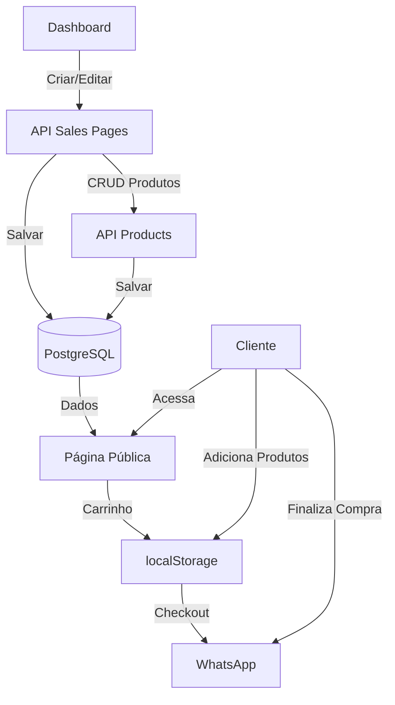

# Plano: Módulo de Página de Vendas

## Visão Geral

Criar um módulo completo de página de vendas que permite ao usuário criar uma loja virtual personalizada, adicionar produtos (até 50), gerenciar carrinho e finalizar compras via WhatsApp com mensagem detalhada.

## Arquitetura




## 1. Banco de Dados

### 1.1 Migration: `migrations/XXX_create_sales_pages_module.sql`

**Tabela `sales_pages`:**

- `id` (SERIAL PRIMARY KEY)
- `profile_item_id` (INTEGER, FK para profile_items)
- `store_title` (VARCHAR(255)) - Título da loja
- `store_description` (TEXT) - Descrição da loja
- `button_text` (VARCHAR(100)) - Texto do botão personalizado
- `button_logo_url` (TEXT) - URL da logo do botão
- `background_color` (VARCHAR(7)) - Cor de fundo (#hex)
- `text_color` (VARCHAR(7)) - Cor do texto
- `button_color` (VARCHAR(7)) - Cor do botão
- `button_text_color` (VARCHAR(7)) - Cor do texto do botão
- `background_image_url` (TEXT) - Imagem de fundo opcional
- `whatsapp_number` (VARCHAR(20)) - Número WhatsApp para checkout
- `created_at`, `updated_at` (TIMESTAMP)

**Tabela `sales_page_products`:**

- `id` (SERIAL PRIMARY KEY)
- `sales_page_id` (INTEGER, FK para sales_pages)
- `name` (VARCHAR(255) NOT NULL)
- `description` (TEXT)
- `price` (DECIMAL(10,2) NOT NULL)
- `image_url` (TEXT)
- `display_order` (INTEGER DEFAULT 0)
- `is_active` (BOOLEAN DEFAULT true)
- `created_at`, `updated_at` (TIMESTAMP)

**Índices e Constraints:**

- Índices em `sales_page_id` e `display_order`
- CHECK para `price > 0`
- Limite de 50 produtos por página (validação na API)

## 2. Backend

### 2.1 Rotas API: `routes/salesPages.js`

**Endpoints:**

- `GET /api/profile/items/:itemId/sales-page` - Buscar configuração da página
- `PUT /api/profile/items/:itemId/sales-page` - Atualizar configuração
- `GET /api/profile/items/:itemId/sales-page/products` - Listar produtos
- `POST /api/profile/items/:itemId/sales-page/products` - Adicionar produto
- `PUT /api/profile/items/:itemId/sales-page/products/:productId` - Atualizar produto
- `DELETE /api/profile/items/:itemId/sales-page/products/:productId` - Remover produto
- `PUT /api/profile/items/:itemId/sales-page/products/reorder` - Reordenar produtos

**Validações:**

- Máximo 50 produtos por página
- Preço deve ser > 0
- WhatsApp number deve ser válido
- Verificar ownership do item

### 2.2 Rota Pública: `routes/publicSalesPage.js`

**Endpoint:**

- `GET /:slug/loja/:itemId` - Renderizar página de vendas pública

**Template:** `views/salesPage.ejs`

- Layout responsivo inspirado em grandes e-commerces
- Grid de produtos com cards modernos
- Carrinho lateral (slide-in)
- Header com logo/título da loja
- Footer com informações

### 2.3 Integração em `routes/profile.js`

Adicionar case `sales_page` no switch de criação de itens (similar aos outros módulos).

### 2.4 Registro em `server.js`

```javascript
const salesPagesRoutes = require('./routes/salesPages');
const publicSalesPageRoutes = require('./routes/publicSalesPage');
app.use('/api/profile', apiLimiter, salesPagesRoutes);
app.use('/', publicSalesPageRoutes);
```


## 3. Frontend Dashboard

### 3.1 `public_html/dashboard.html`

**Adicionar no modal de módulos:**

```html
<div class="module-choice-card" data-item-type="sales_page">
    <i class="fas fa-store"></i>
    <span>Página de Vendas</span>
</div>
```


### 3.2 `public_html/dashboard.js`

**Funções principais:**

1. **`renderItemEditor`** - Adicionar case `sales_page`:

- Formulário de configuração da página
- Campos: título, descrição, cores, imagem de fundo
- Upload de logo do botão
- Campo WhatsApp number
- Seção de produtos com lista e botão "Adicionar Produto"

2. **`openEditModal`** - Adicionar case `sales_page`:

- Carregar configuração da página via API
- Carregar lista de produtos
- Renderizar formulário completo

3. **`saveAllChanges`** - Adicionar case `sales_page`:

- Salvar configuração da página
- Salvar produtos (com validação de limite)

4. **Novas funções:**

- `loadSalesPageData(itemId)` - Carregar dados da página
- `loadSalesPageProducts(itemId)` - Carregar produtos
- `openProductEditModal(productId, itemId)` - Modal de edição de produto
- `saveProduct(productData, itemId)` - Salvar produto
- `deleteProduct(productId, itemId)` - Deletar produto
- `reorderProducts(itemId, newOrder)` - Reordenar produtos

**Estrutura do modal de edição:**

- Aba "Configurações": título, descrição, cores, imagens, WhatsApp
- Aba "Produtos": lista de produtos com ações (editar, deletar, reordenar)
- Botão "Adicionar Produto" abre modal de produto

## 4. Frontend Público

### 4.1 `views/salesPage.ejs`

**Estrutura da página:**

- Header fixo com logo/título e ícone de carrinho
- Hero section (opcional, com imagem de fundo)
- Grid de produtos (3 colunas desktop, 2 tablet, 1 mobile)
- Carrinho lateral (slide-in da direita)
- Footer com informações da loja

**Componentes:**

- Card de produto: imagem, nome, descrição, preço, botão "Adicionar"
- Carrinho: lista de itens, quantidades, total, botão "Finalizar Compra"
- Modal de produto (opcional): visualização ampliada

### 4.2 `public/css/salesPage.css`

**Estilos:**

- Layout responsivo grid
- Animações suaves (fade-in, slide)
- Cards de produto com hover effects
- Carrinho com animação slide-in
- Cores personalizáveis via CSS variables

### 4.3 JavaScript: `public/js/salesPage.js`

**Funcionalidades:**

1. **Gerenciamento de Carrinho (localStorage):**
   ```javascript
    - addToCart(product)
    - removeFromCart(productId)
    - updateQuantity(productId, quantity)
    - getCart()
    - clearCart()
    - getCartTotal()
   ```


2. **Checkout WhatsApp:**
   ```javascript
    - formatWhatsAppMessage(cart, storeInfo)
    - redirectToWhatsApp(message, phoneNumber)
   ```


**Formato da mensagem:**

   ```javascript
         Olá! Gostaria de comprar os seguintes produtos:
         
         📦 Produto 1 - R$ 50,00 (Qtd: 2)
         📦 Produto 2 - R$ 30,00 (Qtd: 1)
         
         Total: R$ 130,00
   ```


3. **UI Interactions:**

- Abrir/fechar carrinho
- Atualizar contador de itens
- Atualizar total do carrinho
- Animações de adicionar ao carrinho

## 5. Fluxo de Uso

1. **Criação:**

- Usuário clica "Adicionar" → Seleciona "Página de Vendas"
- Modal abre com formulário de configuração
- Usuário preenche título, descrição, cores, WhatsApp
- Usuário adiciona produtos (até 50)
- Salva alterações

2. **Visualização Pública:**

- Cliente acessa `/:slug/loja/:itemId`
- Vê página de vendas personalizada
- Navega produtos, adiciona ao carrinho
- Carrinho persiste no localStorage
- Clica "Finalizar Compra" → Redireciona WhatsApp com mensagem detalhada

## 6. Arquivos a Criar/Modificar

**Novos arquivos:**

- `migrations/XXX_create_sales_pages_module.sql`
- `routes/salesPages.js`
- `routes/publicSalesPage.js`
- `views/salesPage.ejs`
- `public/css/salesPage.css`
- `public/js/salesPage.js`

**Arquivos a modificar:**

- `public_html/dashboard.html` - Adicionar card do módulo
- `public_html/dashboard.js` - Adicionar lógica de edição
- `routes/profile.js` - Adicionar case sales_page
- `server.js` - Registrar rotas

## 7. Design Inspiração

**Elementos de grandes e-commerces:**

- **Amazon**: Cards de produto limpos, informações claras
- **Mercado Livre**: Grid responsivo, carrinho lateral
- **Magazine Luiza**: Cores vibrantes, CTAs destacados
- **Casas Bahia**: Organização por categorias (futuro)

**Características implementadas:**

- Grid de produtos responsivo
- Cards com imagem destacada
- Preço em destaque
- Botão de ação claro
- Carrinho acessível
- Layout limpo e profissional

## 8. Validações e Segurança

- Verificar ownership do item antes de modificar
- Validar limite de 50 produtos
- Sanitizar inputs (XSS prevention)
- Validar formato de WhatsApp number
- Validar URLs de imagens
- Rate limiting nas APIs

## 9. Testes Sugeridos

- Criar página de vendas completa
- Adicionar 50 produtos
- Tentar adicionar 51º produto (deve falhar)
- Adicionar produtos ao carrinho
- Fechar e reabrir navegador (carrinho deve persistir)